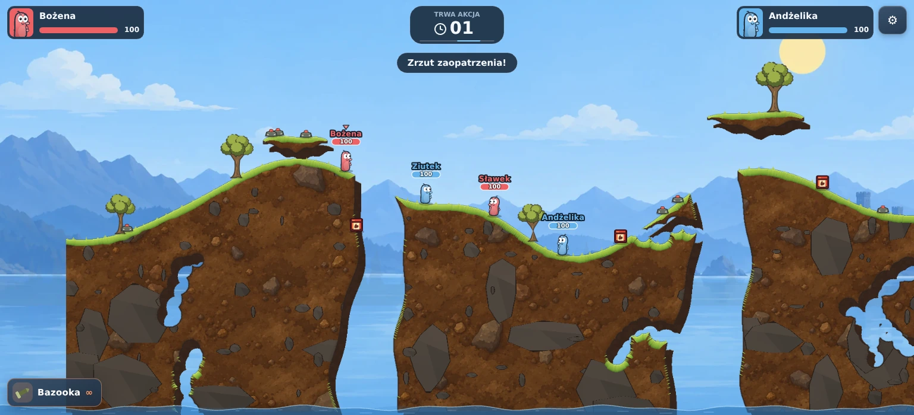
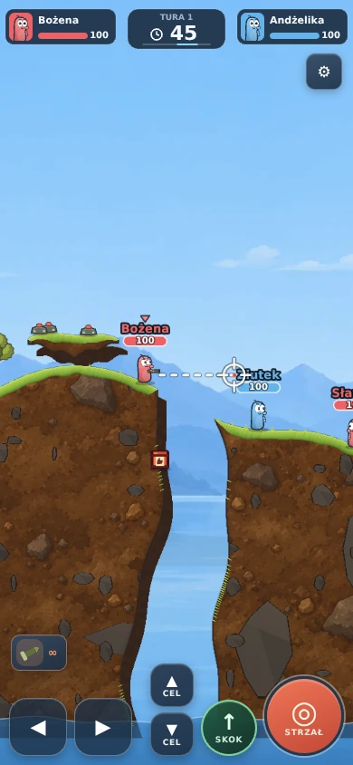
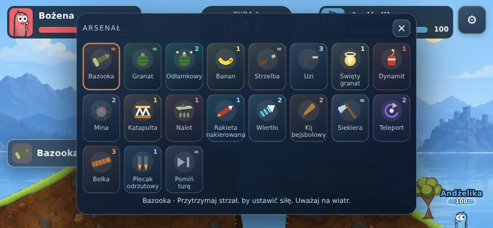

# Malowana oprawa Wormsy

Oprawa jest inspirowana dostarczonym kadrem: spokojne niebieskie tło, ciepła ziemia, ciemniejsza tylna ściana przekroju, oliwkowa trawa i smukłe robaczki z wyraźnym konturem.

## Zakres

- Cztery spójne malowane panoramy: jezioro, zima, pustynia i wulkan. Osobna warstwa sylwetek ma delikatny parallax.
- Dwa canvasy terenu: właściwa ziemia i przesunięta ciemna tylna ściana. Obie warstwy podlegają temu samemu niszczeniu. Malowany materiał, nieregularne kamienie, miękkie krawędzie i krótkie kępki trawy zastępują drobny szum i pasy geologiczne.
- Smuklejsze robaczki z podwiniętą podstawą, większymi oczami i matowym cieniowaniem. Portrety HUD używają tego samego rysunku co postaci.
- Nowe drzewa, drewniane skrzynki, miny z czerwonym przyciskiem, oznaczenia beczek, spokojniejsze kolory broni, dym i nieregularne odłamki.
- Granatowy HUD z portretami, HP odpowiadającym robaczkowi na mapie, centralnym zegarem i czerwonym celownikiem. Spójne menu, arsenał i przyciski dotykowe.
- Nieregularne ściany przepaści i zwężane spody wysp zamiast pionowych szczelin i eliptycznych platform.

## Weryfikacja

`npm run typecheck`, `npm test` i `npm run build`: poprawne. 22 pliki testowe, 246 testów. Dwa nowe testy porównują widoczne piksele obu warstw po częściowym i pełnym przemalowaniu oraz sprawdzają, że krater nie zmienia odległej ziemi. Kontrola z prawdziwym Canvas w Chromium potwierdziła identyczne widoczne piksele obu warstw po nakładających się kraterach.

Podglądy przeglądarkowe obejmują ekran 1536×700, telefon 844×390 i 390×844, arsenał oraz wszystkie cztery motywy. Nie jest to pomiar wydajności na fizycznym telefonie.

## Koszt grafiki i zgodność

Nowe WebP zajmują łącznie 375 436 bajtów. Usunięte nieużywane panoramy zajmowały 1 746 952 bajty. Materiał ziemi jest dekodowany raz do wspólnego kafla 768×768; drzewa i sylwetki tła są buforowane. Teren jest odmalowywany tylko w zmienionych obszarach. Usunięto pełnoekranowe rozmycie, bloom i aberrację chromatyczną; został krótki efekt uderzenia.

Adresy zasobów pozostają względne wobec dokumentu, także dla lokalnego APK. Fizyczny rozmiar robaczków i protokół sieciowy pozostają bez zmian. Generator map zmienił kształty, więc klient i host muszą używać tej samej wersji kodu. Starszy klient może wygenerować inny teren z tego samego ziarna; aktualizację należy dostarczyć po obu stronach.

Panoramy i materiał ziemi powstały przy użyciu wbudowanego ImageGen. Pozostałe elementy są rysowane w Canvas. Dokładne prompty i ścieżki zasobów znajdują się w [art-prompts.md](art-prompts.md).
